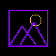
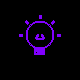
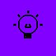
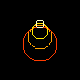

# LIFX Smart Lights Plugin for Logitech / Loupedeck

A C# plugin for Logitech MX Creative Console and Loupedeck consoles that allows you to control your LIFX smart lights with ultra-low latency using a hybrid LAN UDP and Cloud API architecture.


## Features

> [!NOTE]
> * **Hybrid LAN & Cloud Architecture:** Blends fast local UDP control (latency `< 5ms`) with Cloud API fallbacks.
> * **Parallel Execution:** Commands are sent to all target bulbs in parallel for near-instant room adjustments.
> * **Smart Recovery:** Automatically bypasses offline or unreachable local bulbs using a 15-second local failure debounce cache, ensuring that online bulbs continue to react instantly.
> * **Finesse Dial Control:** Features fine-tuned tick increments and a highly responsive 100ms coalescing throttle delay for immediate tactile feedback.
> * **Premium Visual Aesthetics:** Custom-rendered keypad buttons featuring a premium black background and vibrant purple (`#8200FF`) text.
> * **Asynchronous UI:** All API operations run in background threads to keep the console UI and displays completely lag-free.
> * **Local Settings:** Securely reads your Personal Access Token from your Documents or local user profile.

> [!IMPORTANT]
> * **Room Selector:** The first action you map must be a Room Selector key. This button dynamically highlights by inverting to a purple background when a room/group is active. All subsequent buttons will apply their effects to this selected room. If no Room Selector is active, the console defaults to global control.

<br>

| Feature/Effect | Icon(s) | Description |
| :--- | :---: | :--- |
| **LIFX Scenes** |  | Map scenes configured in the LIFX app to keypad buttons. Renders a custom picture frame icon. |
| **LIFX Light Selector** |  /  | Select an individual light to control directly. Room and Light selections are mutually exclusive (selecting one deselects the other). |
| **Light Reachability** |  | Offline or unreachable lights display a muted gray bulb with a crossed-out slash. |
| **Active Room Selector Model** |  /  | Map selector keys to make a specific room "Active". The button dynamically highlights by inverting to a purple background. **Note:** *You must select a room/group first before dials and general buttons will apply to it.* (Defaults to global control if none is active). |
| **Brightness Control** |  | Adjust active room brightness smoothly using console dials or rollers in 1% increments. Press the dial to reset brightness back to 100%. |
| **Color & Hue Selection** |  | Use dial controls to sweep through the complete HSL color spectrum in 2° increments for rich, vivid color lighting. |
| **Temperature & Warmth** |  | Dynamically shift the warmth of white light in 100K increments between warm orange candlelight (1500K) and cool daylight (9000K). |
| **Breathe Effect** |  | Slowly pulsates the light between a target color (default: purple) and its current state. |
| **Move Effect** |  | Shifts color patterns across multi-zone devices (like Z-Strips, Beams, or Tiles). |
| **Morph Effect** |  | Blends colors together smoothly across multi-zone lights. |
| **Flame Effect** |  | Simulates a cozy, flickering flame effect on Candle or Matrix products. |
| **Pulse Purple** |  | Flashes the light quickly between a target color (default: purple) and its current state. |
| **Clouds Effect** |  | Simulates gentle, slow-moving clouds across multi-zone lights. |
| **Sunrise Effect** |  | Gradually transition the light brightness and warmth upward to simulate sunrise. |
| **Sunset Effect** |  | Gradually transition the light downward to simulate a sunset. |
| **Effects off** |  | Instantly terminates any active hardware or software effects on the light. |
| **Cycle** |  | Cycles the light state sequentially through a predefined color wheel list. |

<br>

## Getting Started

### 1. Configure your LIFX Token
To enable the plugin to talk to your lights, you need to provide your Personal Access Token:
1. Log in to **[LIFX Cloud Settings](https://cloud.lifx.com/settings)**.
2. Under **"Personal Access Tokens"**, click **"Generate New Token"**.
3. Copy the token immediately.
4. Save it into a file named `.lifx_token` inside your Windows user directory (e.g., `C:\Users\YOUR_USERNAME\.lifx_token`) or `LIFX_Token.txt` inside your Documents folder.
   * *Alternatively*, in WSL you can run:
     ```bash
     echo "your_lifx_token_here" > "/mnt/c/Users/YOUR_USERNAME/.lifx_token"
     ```

### 2. Build and Deploy the Plugin
You can use the provided `Makefile` to automate building, deploying, and restarting the service:

* **Install the .NET 8.0 SDK** (if you don't have it installed in `/home/eole/.dotnet`):
  ```bash
  make prepare
  ```
* **Build, deploy, and restart** the LogiPluginService on Windows in one command:
  ```bash
  make
  ```
* **Individual Makefile targets**:
  * `make prepare`: Installs the .NET SDK if missing, and automatically verifies/prompts for the LIFX token.
  * `make setup-token`: Detects if the LIFX token is configured, and prompts you to enter it if missing.
  * `make status`: View the current build environment configuration (dotNET path, token config, directories, etc.).
  * `make build`: Only compiles the C# solution (verifies that the .NET SDK is installed first).
  * `make deploy`: Cleans the Windows plugin AppData directory and copies compiled dlls.
  * `make restart`: Restarts the Logitech LogiPluginService on Windows.
  * `make publish`: Packages the plugin as a `.lproj4` archive and saves it to the Windows Downloads directory.
  * `make clean`: Cleans build artifacts.

### 3. Assign Actions
1. Open **Logi Options+** on Windows and select the **MX Creative Keypad**.
2. Click **Customize Keys** to open the customization panel.
3. Close the Plugins Manager to return to the **Action Picker** on the right side.
4. Click **`ALL ACTIONS`** at the top of the picker, locate the **LIFX** category, and drag and drop actions (Toggle and Brightness) onto your dial or button keys.

---

## Changelog

### v1.2 (Current Version)
* **Local LAN UDP Control:** Implemented full local network control on standard port `56700` for sub-5ms latency.
* **Parallel Execution & Smart Recovery:**
  * Enabled parallel UDP transmission to multiple target lights.
  * Added a `15-second` local failure cache; if a light goes offline, the plugin routes its commands straight to the background Cloud API queue, avoiding UDP timeout delays (`250ms`) for other online bulbs.
  * If a bulb fails local UDP command, only that individual bulb falls back to Cloud API rather than dragging down the entire group command.
* **Refined Dial Sensitivity & Detail:**
  * Increased precision: Brightness changes by **1%** per tick, Hue by **2°** per tick, and Warmth by **100K** per tick.
  * Reduced default coalescing throttle delay from **350ms** to **100ms** to provide instant real-time physical dial responsiveness.
* **Diagnostics Clean-up:** Filtered self-received discovery broadcast loopback packets (`000000000000` MAC) from logs.

### v1.1
* **Token Configuration Restore:** Restored local file-based token loading via Documents folder (`LIFX_Token.txt`) or profile folder (`.lifx_token`), resolving Options+ UI initialization crashes.
* **Core C# Plugin Features:**
  * **Room & Group Selector:** Implemented room/group selector keys with dynamic button highlight state (inverting to purple background when selected).
  * **LIFX Scenes:** Added support for executing configured Cloud scenes via keypad buttons (rendering custom picture frame templates).
  * **Light Selector:** Added individual light selection keys, featuring mutually exclusive state logic with room selections.
  * **Light Reachability:** Implemented offline/unreachable light detection (displays muted gray bulb icon).
  * **State Cycle:** Created sequential state color wheel cycling.
  * **Tactile Adjustments:** Added dynamic brightness controls (press dial to reset to 100%), full hue/color spectrum sweeping, and white warmth shifting (1500K to 9000K).
  * **Hardware Effects:** Added actions to activate/control Breathe, Pulse, Move, Morph, Flame, Clouds, Sunrise, and Sunset effects, alongside a general "Effects Off" cancellation key.
  * **Asynchronous Execution:** Background-threaded HTTP Cloud API requests to prevent console displays/dials from freezing.

---

## Useful Links

* **[Logi Actions SDK](https://github.com/logitech/actions-sdk)** - Official Logitech Actions SDK repository for building console plugins.
* **[Logitech MX Creative Console](https://www.logitech.com/products/keyboards/mx-creative-console.html)** - Official product page for the keypad and dialpad.
* **[LIFX Smart Lights](https://www.lifx.com/)** - Official website for LIFX smart lighting.
* **[LIFX Developer API](https://api.developer.lifx.com/)** - Official LIFX HTTP API documentation.
* **[.NET SDK](https://dotnet.microsoft.com/)** - Official homepage for the .NET development platform.
* **[Google Antigravity](https://antigravity.google/)** - Official website for the Google DeepMind agentic development platform.

---

## Disclaimer

This is an unofficial, independent plugin developed using Google DeepMind's **Antigravity** AI coding assistant. It is not affiliated with, authorized, maintained, sponsored, or endorsed by Logitech, Loupedeck, or LIFX. All product and company names are trademarks™ or registered® trademarks of their respective holders.
