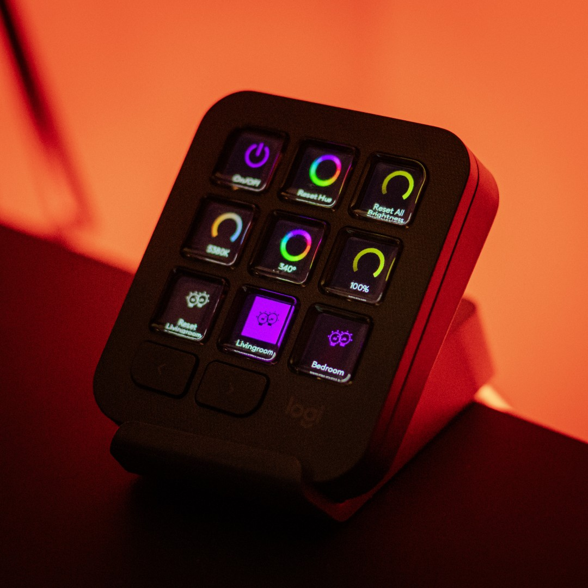

# LIFX Smart Lights Plugin for Logitech / Loupedeck

A C# plugin for Logitech MX Creative Console and Loupedeck consoles that allows you to control your LIFX smart lights via the LIFX Cloud API.



## Features

| Feature | Icon(s) | Description |
| :--- | :---: | :--- |
| **Active Room Selector Model** |  /  | Map selector keys to make a specific room "Active". The button dynamically highlights by inverting to a purple background. **Note:** *You must select a room/group first before dials and general buttons will apply to it.* (Defaults to global control if none is active). |
| **Brightness Control** |  | Adjust active room brightness smoothly using console dials or rollers. Press the dial to reset brightness back to 100%. |
| **Color & Hue Selection** |  | Use dial controls to sweep through the complete HSL color spectrum for rich, vivid color lighting. |
| **Temperature & Warmth** |  | Dynamically shift the warmth of white light between warm orange candlelight (1500K) and cool daylight (9000K). |
| **Premium Visual Aesthetics** | — | Custom-rendered keypad buttons featuring a premium black background and vibrant purple (`#8200FF`) text. |
| **Asynchronous UI** | — | Background-threaded API operations to keep your console's dials and displays completely lag-free. |
| **Local Settings** | — | Securely and automatically reads your Personal Access Token from your local Windows user profile. |

---

## Getting Started

### 1. Configure your LIFX Token
To enable the plugin to talk to your lights, you need to provide your Personal Access Token:
1. Log in to **[LIFX Cloud Settings](https://cloud.lifx.com/settings)**.
2. Under **"Personal Access Tokens"**, click **"Generate New Token"**.
3. Copy the token immediately.
4. Save it into a file named `.lifx_token` inside your Windows user directory (e.g., `C:\Users\YOUR_USERNAME\.lifx_token`).
   * *Alternatively*, in WSL you can run:
     ```bash
     echo "your_lifx_token_here" > "/mnt/c/Users/YOUR_USERNAME/.lifx_token"
     ```

### 2. Build the Plugin
Compile the C# solution using .NET 8.0 SDK:
```bash
# Run this inside your workspace
/home/eole/.dotnet/dotnet build LifxPlugin/LifxPlugin.sln \
  -p:PluginApiDir="/mnt/c/Program Files/Logi/LogiPluginService/" \
  -p:PluginDir="/home/eole/projects/actions-sdk/LifxPlugin/build_links/"
```

### 3. Deploy and Run
To deploy the plugin locally on Windows:
1. Copy the compiled `bin/` and `metadata/` directories into a new plugin directory in Options+:
   ```bash
   # Remove any old version and create the target folder
   rm -rf "/mnt/c/Users/YOUR_USERNAME/AppData/Local/Logi/LogiPluginService/Plugins/Lifx"
   mkdir -p "/mnt/c/Users/YOUR_USERNAME/AppData/Local/Logi/LogiPluginService/Plugins/Lifx"
   
   # Copy build directories
   cp -r LifxPlugin/LifxPlugin/Debug/bin "/mnt/c/Users/YOUR_USERNAME/AppData/Local/Logi/LogiPluginService/Plugins/Lifx/"
   cp -r LifxPlugin/LifxPlugin/Debug/metadata "/mnt/c/Users/YOUR_USERNAME/AppData/Local/Logi/LogiPluginService/Plugins/Lifx/"
   ```
2. Restart the **LogiPluginService** on Windows to apply the plugin:
   ```bash
   powershell.exe -Command "Stop-Process -Name LogiPluginService -Force"
   ```

### 4. Assign Actions
1. Open **Logi Options+** on Windows and select the **MX Creative Keypad**.
2. Click **Customize Keys** to open the customization panel.
3. Close the Plugins Manager to return to the **Action Picker** on the right side.
4. Click **`ALL ACTIONS`** at the top of the picker, locate the **LIFX** category, and drag and drop actions (Toggle and Brightness) onto your dial or button keys.

---

## Disclaimer

This is an unofficial, independent plugin developed using Google DeepMind's **Antigravity** AI coding assistant. It is not affiliated with, authorized, maintained, sponsored, or endorsed by Logitech, Loupedeck, or LIFX. All product and company names are trademarks™ or registered® trademarks of their respective holders.

